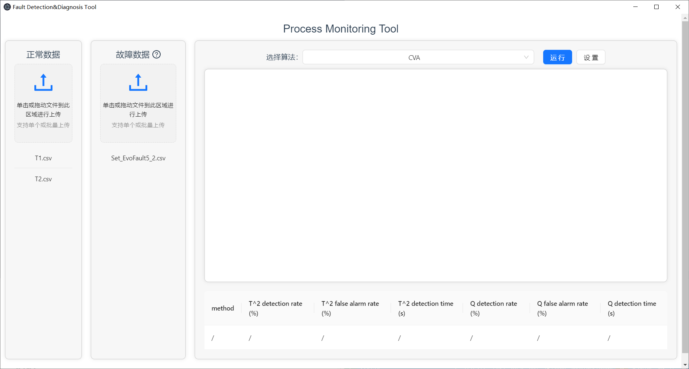

# ProcessMonitoringTool(FDDTool)

> Process monitoring, also known as Fault Detection and Diagnosis (FDD)

本项目实现了一个过程监测的可视化软件——FDDTool


FDDtool的定位是一个过程监测算法和数据的测试平台，也可以扩展为实时的过程监测工具。

它通过使用过程监测算法，在导入的正常数据中进行模型训练，在导入的故障数据进行过程监测，并将可视化结果返回前端。

**软件目前具有CVA、DiPCA、DiPLS、SVDD、SFA等过程监测算法**

> 在FDDTool-backend文件夹内

**软件技术栈**

前端：VUE3（前端框架）+antdv（样式组件）+electron（构建桌面程序）+axios（请求后端）

后端：python&FastAPI（后端服务以及过程监测算法）+matlab（部分过程监测算法）


# 软件使用

**环境配置**

> 本软件采用前后端分离的架构。在进行各种操作之前，需要确保后端服务已启动。

以下是本地运行后端代码所需的环境配置：

- Python库：FastAPI（用于后端服务）、Plotly（用于绘图）
- Python的MATLAB引擎（用于调用MATLAB代码）
- MATLAB 2020a或更高版本（用于编译和运行MATLAB代码）

**使用步骤**

1. **开启后端服务**(FDDTool-backend)

   - 可以通过运行main.py开启后端服务

     

   - （可选）也可以在后端代码文件夹内的路径下打开终端，执行`uvicorn main:app --reload`命令

   开启服务后可以在终端监听前端的请求

   

   

2. **运行软件前端**(FDDTool-frontend)

   - 在前端代码文件夹内的路径下打开终端，执行以下命令

   ```bash
   # 安装依赖包
   yarn install
   
   # 根据需要执行以下命令
   yarn run serve        # 启动 Web 端服务
   yarn run build        # 打包 Web 端代码
   yarn electron:serve   # 启动桌面端应用
   yarn electron:build   # 打包桌面端应用
   ```

   > 软件同时支持web端和桌面端

   

   

3. **上传数据到软件左侧**。您可以单击上传区域或将文件拖动到上传区域以完成上传。上传的数据将在下方显示。

   > 注意1：仅支持CSV文件。
   >
   > 注意2：对于上传的故障数据，请确保数据的最后一列包含故障标签信息，即表示故障程度或是否故障的列。

   > **在"数据集/csv"文件夹中：**
   >
   > “T1.csv、T2.csv、T3.csv”是系统正常运行时的数据。
   >
   > “Set_EvoFault1_1.csv”等文件是系统发生故障时的数据（并且包含故障标签列）。
   >
   > **这些文件可用于进行软件测试。**

4. **点击，选中数据**（正常和故障数据）

   

5. **选择算法**

   

6. （可选）**运行设置**。可设置是否计算并返回算法的性能指标

   

7. **点击运行按钮。**过程监测结果会在下方展示：

   

   


# 其它

#### 数据集说明

Cranfield Multiphase Flow Facility获取的三相流数据集

> reference：https://www.kaggle.com/datasets/afrniomelo/cranfield/discussion

原始数据集中：‘Training.mat’文件是正常运行时的数据，而’FaultCase1-6.mat’是发生不同故障时的数据

本项目对原始数据集做了一定处理：

- 数据集处理1：为方便python处理，编写脚本把mat数据的所有矩阵数据都导出为csv文件保存
- 数据集处理2：为方便计算检出率等指标，将原本代表故障程度的EvoFault数据和故障过程变量Set数据进行了合并，将其拼接在Set数据的最后一列


#### 后端API文档

1. **数据导入**

URL：`/upload`

方法：`POST`

描述：导入数据到，并存储在服务后台

请求参数：

| 参数名 | 参数值   | 参数描述 |
| ------ | -------- | -------- |
| file   |          | 文件     |
| type   | “normal” | 数据类型 |

响应：

```json
{
    "message":'success'
}
```


2. **获取数据列表**

URL：`/DataList`

方法：`GET`

描述：获取所有正常/故障数据的名称

请求参数：

| 参数名 | 参数值   | 参数描述 |
| ------ | -------- | -------- |
| type   | “normal” | 数据类型 |

响应：

```json
{
    "data":["T1.csv","T2.csv","T3.csv"],
    "message":'success'
}
```


3. **删除数据**

URL：`/delete`

方法：`GET`

描述：根据文件名删除某正常/故障数据

请求参数：

| 参数名    | 参数值   | 参数描述 |
| --------- | -------- | -------- |
| file_name | "T1.csv" | 文件名   |
| type      | “normal” | 数据类型 |

响应：

```json
{
    "message":'success'
}
```


4. 过程监测

URL：`/run`

方法：`POST`

描述：利用数据训练模型，故障数据中进行过程监测，返回过程监测结果——可视化图表的URL链接

请求参数：

| 参数名     | 参数值       | 参数描述       |
| ---------- | ------------ | -------------- |
| NormalName | “T1.csv”     | 正常数据文件名 |
| FaultName  | “Set4_1.csv” | 故障数据文件名 |
| Method     | "CVA"        | 算法名称       |

响应：

```json
{
    "html_url": '127.0.0.1:5000'
}
```


